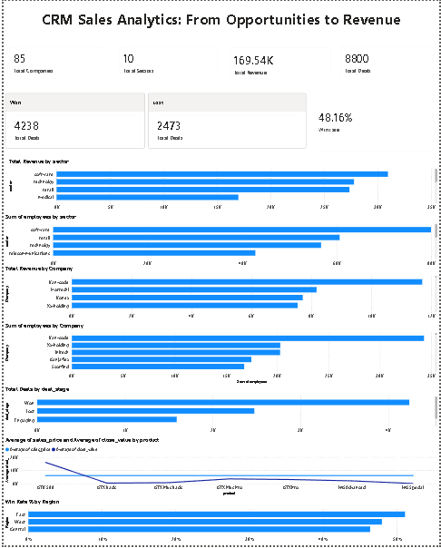

# CRM Sales Analytics: From Opportunities to Revenue

**Tools:** SQL, SQLite, Power BI, DAX

**Project Type:** End-to-End Sales Analytics Project

---

## 1. Project Overview

This project analyzes CRM sales data using SQL and Power BI to evaluate company performance, sector performance, product performance, and sales team effectiveness.

The primary objective is to uncover meaningful business insights by examining relationships between revenue, workforce size, customer distribution, sales opportunities, and product performance. The project also focuses on understanding sales conversion patterns and regional sales performance through data-driven analysis.

---

## 2. Business Problem

The business aims to better understand its sales performance and identify factors that influence revenue generation and deal success.

### Key Questions Addressed

- How are revenue and employee count related?
- Which sectors contribute the highest revenue?
- Which products perform best in terms of sales?
- How effective are sales agents and regional sales teams?
- What is the overall deal win rate?
- How do deal stages progress through the sales pipeline?
- How does actual deal value compare with listed product prices?

---

## 3. Dataset Description

The dataset consists of four related tables that represent different aspects of the CRM sales process.

### Accounts

Contains information about customer companies.

**Columns:**
- account
- sector
- year_established
- revenue
- employees
- office_location
- subsidiary_of

### Products

Contains product information and pricing details.

**Columns:**
- product
- series
- sales_price

### Sales Teams

Contains information about sales agents, managers, and regional offices.

**Columns:**
- sales_agent
- manager
- regional_office

### Sales Pipeline

Contains sales opportunity and deal information.

**Columns:**
- opportunity_id
- sales_agent
- product
- account
- deal_stage
- engage_date
- close_date
- close_value

---

## 4. Tools Used

- SQL – Data exploration, KPI calculation, and business analysis
- SQLite (DB Browser for SQLite) – Database creation and query execution
- Power BI – Dashboard development and data visualization
- DAX (Data Analysis Expressions) – KPI and measure creation within Power BI

---

## 5. KPIs Analyzed

The following Key Performance Indicators (KPIs) were analyzed to evaluate business performance and sales effectiveness:

- Total Companies
- Total Sectors
- Total Products
- Total Revenue
- Total Sales Opportunities (Deals)
- Total Won Deals
- Total Lost Deals
- Overall Win Rate (%)
- Top Revenue-Generating Sector
- Top Revenue-Generating Company

---

## 6. Dashboard

## Dashboard Preview

*

### KPI Cards

- Total Companies
- Total Sectors
- Total Revenue
- Total Sales Opportunities (Deals)
- Total Won Deals
- Total Lost Deals
- Overall Win Rate (%)

### Visualizations

- Top Sectors by Total Revenue
- Top Sectors by Number of Employees
- Top Companies by Revenue
- Top Companies by Number of Employees
- Distribution of Deals by Deal Stage (Won, Lost, Engaging)
- Average Sales Price vs Average Close Value by Product
- Win Rate by Region

---

## 7. Key Insights

### Revenue & Workforce Analysis

- Companies with larger workforces generally generate higher revenue, indicating a positive relationship between organizational scale and revenue potential.
- Revenue rankings closely align with employee-count rankings across sectors, suggesting business size is a significant contributor to revenue generation.

### Sector Performance

- The Software sector generates the highest revenue despite having fewer companies than some other sectors.
- Sector performance appears to be influenced more by company scale and market value than by the number of companies within the sector.

### Geographic Distribution

- The majority of companies in the dataset are headquartered in the United States, making it the primary market represented in the analysis.
- Sales teams are distributed relatively evenly across regional offices, providing balanced sales coverage.

### Sales Performance

- The East region records the highest win rate among all regional offices, indicating stronger opportunity conversion performance.
- Won deals significantly outnumber lost deals, reflecting healthy overall sales pipeline performance.

### Product & Pricing Analysis

- Most deals are closed below the listed product sales price, indicating customer sensitivity to pricing and frequent discount negotiations.
- Product pricing performance varies considerably across product categories, suggesting differences in pricing power and customer demand.

### Company Insights

- Kam-Code, one of the oldest companies in the dataset, remains among the strongest-performing organizations, demonstrating the long-term potential of established businesses.

---

## 8. Recommendations

- Prioritize large enterprise customers due to their higher revenue potential.
- Continue focusing on high-performing sectors such as Software.
- Study and replicate successful sales practices from the East region.
- Review discounting strategies to improve pricing effectiveness and revenue realization.
- Explore opportunities for geographic diversification beyond the U.S. market.
- Target mature and established organizations with strong purchasing power.

---

## 9. Conclusion

This project successfully transformed raw CRM sales data into actionable business insights through SQL analysis and Power BI visualization.

The analysis highlighted key trends in revenue generation, sector performance, regional effectiveness, and product pricing, enabling a better understanding of factors that influence sales success and business growth.

The findings provide actionable recommendations that can support decision-making, improve sales strategies, and enhance overall business performance.
